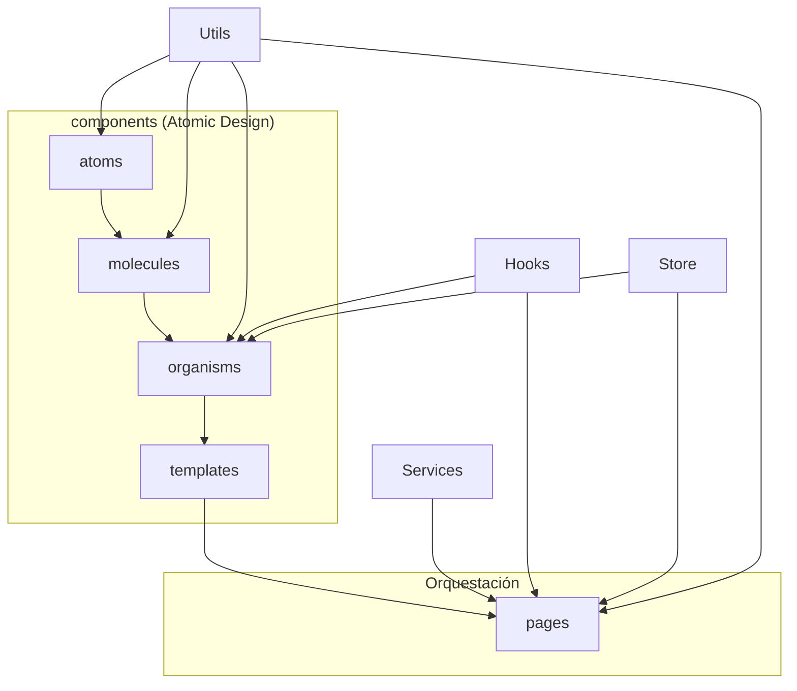
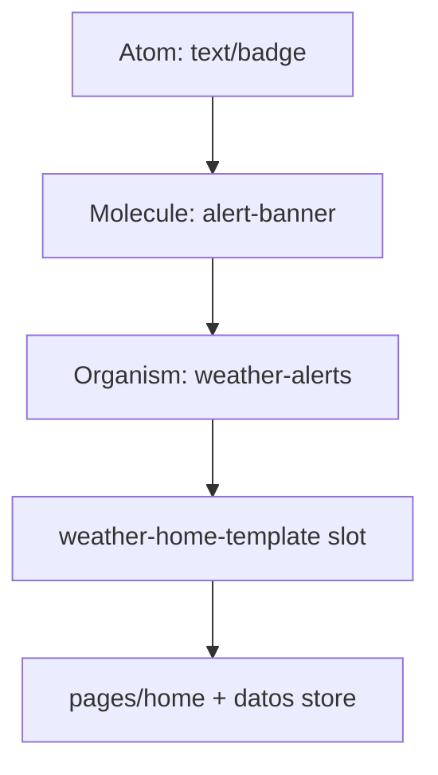

# Atomic Design en este proyecto

Guía práctica de cómo está implementada la metodología en **weather_reactV18**.

Concepto general: [atomic-design.md](./atomic-design.md).

---

## Árbol de carpetas (UI)

```
src/
├── components/
│   ├── atoms/           # UI mínima, sin Redux
│   ├── molecules/       # Combinación de átomos
│   ├── organisms/       # Secciones (pueden usar Redux/hooks)
│   ├── templates/       # Layout / slots de página
│   └── README.md
├── pages/               # Orquestación + datos reales
├── hooks/
├── services/
│   ├── country-services/
│   ├── weather-services/
│   ├── global-services/
│   └── data/
├── store/
│   └── slices/
├── interfaces/
├── utils/
└── global/
```

**Convenciones:**
- Carpetas en **minúsculas** / **kebab-case** (`search-field`, `weather-details`).
- **Sin barrels** (`index.ts`). Import directo al archivo del componente.
- Archivos del componente en PascalCase (`Button.tsx`, `SearchField.tsx`).

```ts
import { SearchField } from "../../components/molecules/search-field/SearchField";
```



---

## Reglas de dependencia

| Capa | Puede importar | No puede importar |
|------|----------------|-------------------|
| `atoms` | `Utils` puros, libs UI | molecules, organisms, templates, pages, Store, Services |
| `molecules` | atoms, Utils | organisms, templates, pages, Store, Services |
| `organisms` | atoms, molecules, Hooks, Store, Utils | pages |
| `templates` | atoms, molecules, organisms | pages, Services (sin fetch propio) |
| `pages` | templates, organisms, Hooks, Store, Services, Utils | — |

**Principio de datos:** átomos y moléculas reciben props. Organisms y pages pueden usar Redux.

---

## Mapa de componentes actuales

### Atoms

| Carpeta | Archivo | Rol |
|---------|---------|-----|
| `atoms/button` | `Button.tsx` | Botón de texto |
| `atoms/icon-button` | `IconButton.tsx` | Botón con icono |
| `atoms/text` | `Text.tsx` | Tipografía base |
| `atoms/heading` | `Heading.tsx` | Títulos |
| `atoms/input` | `Input.tsx` | Input controlado |
| `atoms/divider` | `Divider.tsx` | Separador |
| `atoms/weather-icon` | `WeatherIcon.tsx` | Icono clima por código OWM |
| `atoms/empty-state` | `EmptyState.tsx` | Estado vacío |

### Molecules

| Carpeta | Archivo | Compone |
|---------|---------|---------|
| `molecules/search-field` | `SearchField.tsx` | Input + IconButton |
| `molecules/unit-toggle` | `UnitToggle.tsx` | °C / °F |
| `molecules/forecast-item` | `ForecastItem.tsx` | título + icono + temp |
| `molecules/detail-row` | `DetailRow.tsx` | icono + label + valor |
| `molecules/temp-summary` | `TempSummary.tsx` | resumen temperatura |
| `molecules/sun-temp-range` | `SunTempRange.tsx` | sunrise/sunset + high/low |

### Organisms

| Carpeta | Archivo | Origen legacy |
|---------|---------|---------------|
| `organisms/popular-cities` | `PopularCities.tsx` | TobButton |
| `organisms/search-bar` | `SearchBar.tsx` | InputSearch |
| `organisms/forecast-list` | `ForecastList.tsx` | Forecast |
| `organisms/weather-details` | `WeatherDetails.tsx` | TemperatureAndDetails |
| `organisms/time-and-location` | `TimeAndLocation.tsx` | TimeAndLocation |
| `organisms/weather-background` | `WeatherBackground.tsx` | BackgroundImage |

### Template / Page

| Pieza | Rol |
|-------|-----|
| `templates/weather-home-template/WeatherHomeTemplate.tsx` | Layout: header, search, contenido o empty, footer |
| `pages/home/WeatherHomePage.tsx` | Effects, dispatch, estado local |

---

## Checklist: nueva funcionalidad UI

1. **¿Existe ya un átomo/molécula?** Reutilizar primero.
2. **Clasificar** la pieza con la tabla de dependencias.
3. **Crear carpeta kebab-case** `nombre-componente/NombreComponente.tsx` (sin `index.ts`).
4. **Tipar props** con interfaces (sin `any`).
5. **Sin Redux en atoms/molecules.** Si necesita store → organism o page.
6. **Componer hacia arriba:** molecule → organism → template → page.
7. **Page solo orquesta:** effects, dispatch, services; UI en `components`.
8. **Import directo** al archivo `.tsx` (no barrels).
9. **Actualizar este doc** si introduces un organismo o patrón nuevo.

### Ejemplo: alerta de tormenta



---

## Anti-patrones

| Evitar | Preferir |
|--------|----------|
| `index.ts` barrel | Import directo `.../button/Button` |
| Carpetas PascalCase (`Button/`) | kebab-case (`button/`) |
| `fetch` / `dispatch` en un atom | Callbacks o lógica en page/organism |
| Page importa 12 atoms sueltos | Componer molecules/organisms |
| Services dentro de `atoms/` | Services como capa hermana |

---

## Verificación rápida

```bash
npm run typecheck
npm run build
```
