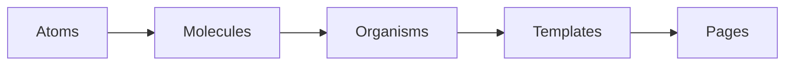

# Atomic Design

## ¿Qué es?

**Atomic Design** es una metodología creada por [Brad Frost](https://atomicdesign.bradfrost.com/) para construir interfaces de forma jerárquica: piezas pequeñas y reutilizables se combinan hasta formar pantallas completas.

La idea es la misma que en química: átomos → moléculas → organismos → (en UI) plantillas y páginas.

## Los cinco niveles

### 1. Atoms (átomos)

La unidad UI más pequeña que aún tiene sentido por sí sola.

Ejemplos: botón, input, texto, icono, divisor.

**No** deberían conocer el dominio de negocio ni el store global.

### 2. Molecules (moléculas)

Grupo de átomos que trabajan juntos como una unidad.

Ejemplo: campo de búsqueda = `Input` + `IconButton`.

Siguen siendo presentacionales: reciben props, emiten eventos.

### 3. Organisms (organismos)

Secciones relativamente complejas de la interfaz.

Ejemplo: barra de búsqueda completa, lista de forecast, bloque de detalles del clima.

Pueden conectar con estado de la app (Redux/hooks) cuando agrupan comportamiento de una sección.

### 4. Templates (plantillas)

Layout de página: define **dónde** van las piezas (slots), no necesariamente con datos reales definitivos.

Ejemplo: cabecera + búsqueda + zona de contenido + footer.

### 5. Pages (páginas)

Instancia concreta del template con datos reales, efectos, llamadas a servicios y orquestación.

Aquí viven `useEffect`, `dispatch`, lectura de rutas, etc.

## Qué problema resuelve

| Problema | Cómo ayuda Atomic Design |
|----------|--------------------------|
| Componentes gigantes e irreutilizables | Fuerza a partir en piezas con una sola responsabilidad |
| Inconsistencia visual | Átomos compartidos (mismo `Button` en toda la app) |
| Dificultad para ubicar código nuevo | Reglas claras de “dónde va cada cosa” |
| Acoplamiento UI ↔ datos | Atoms/molecules sin store; pages orquestan |

## Qué NO es Atomic Design

- No es un framework ni una librería.
- No obliga a meter **services**, **store** o **utils** dentro de `atoms/`.
- No significa crear un átomo por cada etiqueta HTML sin criterio (evitar over-engineering).

En este proyecto, Atomic Design aplica a la **capa UI**. El resto de capas viven al lado: ver [atomic-design-en-el-proyecto.md](./atomic-design-en-el-proyecto.md).
