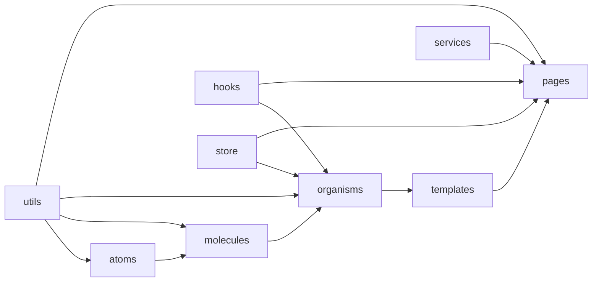
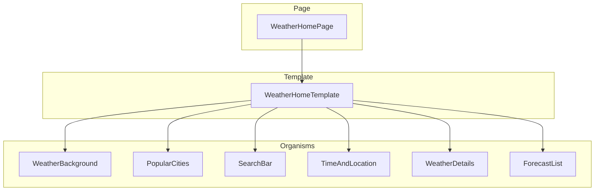

# Diseño: migración a Atomic Design (capa UI)

**Fecha:** 2026-07-28  
**Estado:** pendiente de revisión del usuario  
**Alcance:** solo capa UI (opción A). Services, Store, Hooks, Utils e Interfaces quedan como capas hermanas.

---

## 1. Objetivo

Reorganizar la UI del proyecto weather_reactV18 siguiendo **Atomic Design**, descomponiendo componentes compuestos en átomos/moléculas reutilizables, y entregar documentación permanente sobre:

1. Qué es Atomic Design.
2. Cómo está implementado en este repositorio.
3. Checklist / casos a seguir al crear una nueva funcionalidad.

La app debe seguir comportándose igual tras la migración (refactor estructural, no cambio de producto).

---

## 2. Decisiones validadas

| Decisión | Elección |
|----------|----------|
| Alcance | Solo UI; no meter services/store dentro de atoms/molecules |
| Carpetas | `src/components/{atoms,molecules,organisms,templates}` + `src/pages/` |
| Profundidad | Reubicar **y** descomponer (opción B) |
| Organización interna | Una carpeta por componente + `index.ts` (Enfoque 2) |
| Diagramas | En la documentación Markdown (mermaid), no companion visual |

---

## 3. Arquitectura de carpetas

```
src/
├── components/
│   ├── atoms/          # UI mínima, sin lógica de negocio ni Redux
│   ├── molecules/      # Combinación de átomos
│   ├── organisms/      # Secciones complejas (pueden usar Redux/hooks)
│   └── templates/      # Layout de página (estructura / slots)
├── pages/              # Orquestación: datos, effects, services, store
├── hooks/
├── services/
├── store/
├── interfaces/
├── utils/
└── global/
```

### Reglas de dependencia



| Capa | Puede importar | No puede importar |
|------|----------------|-------------------|
| `atoms` | `utils` puros, libs UI | molecules, organisms, templates, pages, store, services |
| `molecules` | atoms, utils | organisms, templates, pages, store, services |
| `organisms` | atoms, molecules, hooks, store, utils | pages, templates (salvo composición explícita documentada) |
| `templates` | atoms, molecules, organisms | pages, services (sin fetch propio) |
| `pages` | templates, organisms, hooks, store, services, utils | — |

**Principio de datos:** átomos y moléculas reciben props y no hablan con Redux. Organisms y pages sí pueden conectar al store.

---

## 4. Mapa de descomposición (antes → después)

### Átomos previstos

| Componente | Responsabilidad |
|------------|-----------------|
| `Button` | Botón de texto reutilizable |
| `IconButton` | Botón con icono (ubicación, etc.) |
| `Text` | Texto tipográfico base |
| `Heading` | Títulos de sección |
| `Input` | Input controlado |
| `Divider` | Separador (`hr`) |
| `WeatherIcon` | Imagen de icono climático vía código |
| `EmptyState` | Mensaje “Sin búsqueda” / vacío |

### Moléculas previstas

| Componente | Compone |
|------------|---------|
| `SearchField` | `Input` + `IconButton` |
| `UnitToggle` | Botones °C / °F + separador |
| `ForecastItem` | hora/día + `WeatherIcon` + temperatura |
| `DetailRow` | icono + label + valor |
| `TempSummary` | icono grande + temperatura + filas de detalle |
| `SunTempRange` | sunrise/sunset + high/low |

### Organisms previstos

| Actual | Nuevo |
|--------|-------|
| `TobButton` | `PopularCities` (lista de `Button`) |
| `InputSearch` | `SearchBar` (`SearchField` + `UnitToggle`) |
| `Forecast` | `ForecastList` (título + `Divider` + `ForecastItem[]`) |
| `TemperatureAndDetails` | `WeatherDetails` |
| `TimeAndLocation` | `TimeAndLocation` (mantiene nombre, descompuesto con `Text`) |
| `BackgroundImage` | `WeatherBackground` (fondo dinámico + children) |

### Template y Page

| Pieza | Rol |
|-------|-----|
| `WeatherHomeTemplate` | Layout: slots para ciudades populares, búsqueda, contenido clima, empty state |
| `pages/Home/WeatherHomePage` | Effects, dispatch, estado local, pasa props/callbacks al template |



### Convención de archivo por componente

```
src/components/atoms/Button/
  Button.tsx
  index.ts
```

`index.ts` reexporta el componente público. Imports preferidos:

```ts
import { Button } from "@/components/atoms/Button";
```

(Si el proyecto aún no usa alias `@/`, se usan rutas relativas consistentes; el plan de implementación decide si se añade alias en Vite/TS.)

---

## 5. Documentación a entregar

Dos documentos permanentes en `docs/architecture/` (diagramas en Mermaid dentro del Markdown):

### 5.1 `docs/architecture/atomic-design.md`

Explica el concepto:

- Origen (Brad Frost) y jerarquía: Atoms → Molecules → Organisms → Templates → Pages.
- Qué problema resuelve (reutilización, consistencia, escalabilidad).
- Diagrama de jerarquía.
- Qué **no** es Atomic Design en este proyecto (services/store no son “átomos”).

### 5.2 `docs/architecture/atomic-design-en-el-proyecto.md`

Guía de implementación local:

- Árbol real de carpetas del repo.
- Tabla de clasificación de componentes existentes.
- Reglas de dependencia.
- Checklist para **nueva funcionalidad** (ver §6).
- Anti-patrones (ej. meter fetch en un atom, saltarse niveles sin motivo).
- Ejemplo concreto: “añadir un nuevo bloque de alerta meteorológica”.

Un README corto en `src/components/README.md` apunta a esos docs.

---

## 6. Casos / checklist para nueva funcionalidad

Al añadir UI nueva, seguir este orden:

1. **¿Existe ya un átomo/molécula?** Reutilizar antes de crear.
2. **Clasificar** la pieza nueva con la tabla de §3.
3. **Crear carpeta** en el nivel correcto (`ComponentName/ComponentName.tsx` + `index.ts`).
4. **Props tipadas** (interfaces; sin `any`, según regla del repo).
5. **Sin Redux en atoms/molecules.** Si necesita store → organism o page.
6. **Componer hacia arriba:** molecule → organism → template → page.
7. **Page solo orquesta:** effects, dispatch, servicios; UI en components.
8. **Actualizar** `atomic-design-en-el-proyecto.md` si se introduce un patrón nuevo o un organismo de dominio nuevo.

### Ejemplo rápido

> “Mostrar alerta de tormenta”

- Atom: `Badge` o reusar `Text`
- Molecule: `AlertBanner` (icono + texto + botón cerrar)
- Organism: `WeatherAlerts` (lista desde store)
- Template/Page: slot en `WeatherHomeTemplate`, datos en `WeatherHomePage`

---

## 7. Fuera de alcance

- Refactor de Services / Store / Hooks salvo imports rotos por el move.
- Cambios visuales de diseño o nuevas features de producto.
- Tests automatizados nuevos (a menos que el plan de implementación los añada como verificación mínima de build).
- Renombrar carpetas legacy de capa de datos.

---

## 8. Criterios de éxito

- [ ] `src/Components/` legacy eliminado; UI vive bajo `src/components/{atoms,molecules,organisms,templates}`.
- [ ] Páginas en `src/pages/` orquestan; templates componen layout.
- [ ] Átomos/moléculas sin acceso a Redux.
- [ ] App compila y la home muestra el mismo flujo (búsqueda, ciudades populares, detalle, forecast).
- [ ] Docs `atomic-design.md` y `atomic-design-en-el-proyecto.md` publicados con diagramas Mermaid.
- [ ] Tipado estricto sin `any`.

---

## 9. Riesgos y mitigación

| Riesgo | Mitigación |
|--------|------------|
| Imports rotos masivos | Migrar por capas (atoms → molecules → organisms → template → page); verificar build tras cada capa |
| Over-engineering en átomos | Solo extraer lo que aparece ≥1 vez o clarifica el organism |
| Confusión pages vs templates | Page = datos/orquestación; Template = layout/slots presentacionales |
| Case sensitivity Windows (`Components` vs `components`) | Usar minúscula `components`/`pages` de forma consistente en git |

---

## 10. Siguiente paso

Tras aprobación de esta spec: plan de implementación en `docs/superpowers/plans/` (migrar UI + escribir docs + verificación de build).
